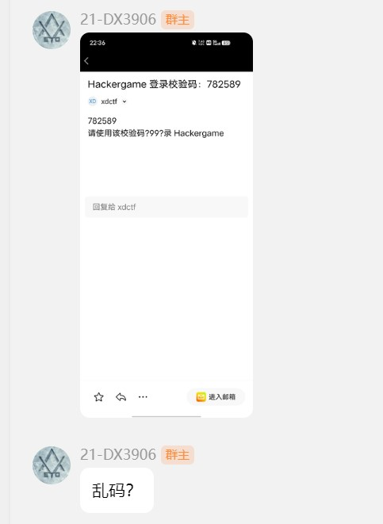
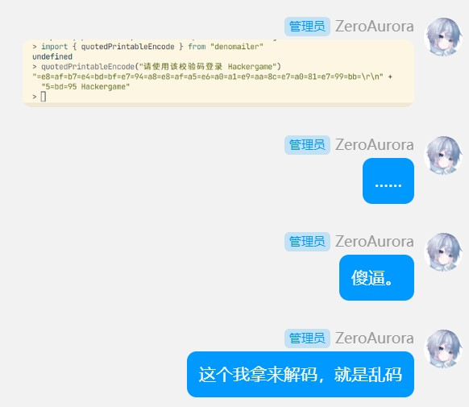
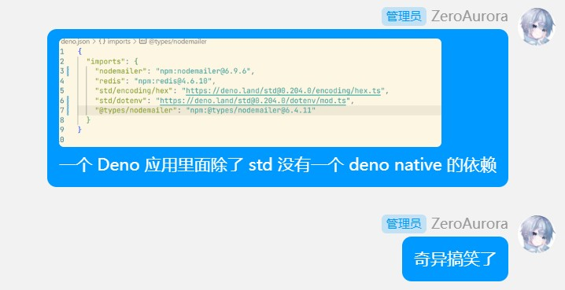
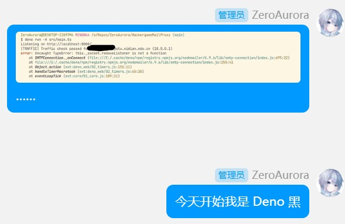
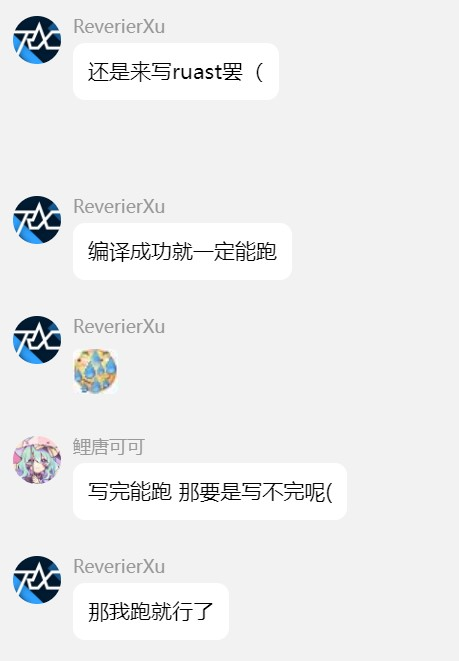
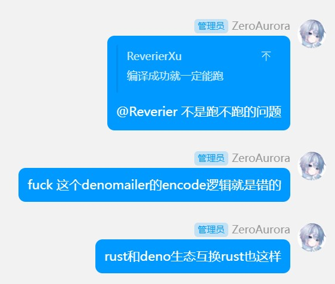

# ~~Hackergame Mail Proxy for XDU~~ Abandoned

## Running

Requires a recent version of [Deno](https://deno.com/) and [Redis](https://redis.io/).

Fill in `.env`, and simply do:

```sh
deno run -A src/main.ts
```

It's easy. But for the safety of your life, don't use Deno in your project.

At lease check for library compability and usability.










## License

WTFPL
